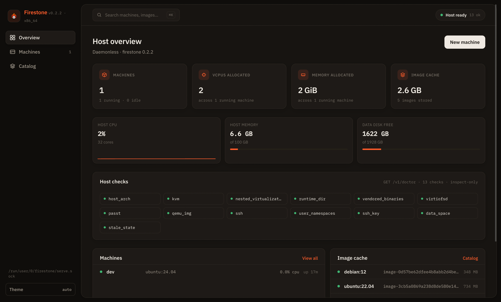

<p align="center">
  <a href="https://firestonevm.gitbook.io"></a>
</p>

<h1 align="center">Firestone</h1>

<p align="center">Linux VMs and OCI container images on Cloud Hypervisor, from one binary.</p>

<p align="center">
  <a href="https://github.com/0xchasercat/firestone/releases/latest"></a>
  <a href="https://github.com/0xchasercat/firestone/actions/workflows/ci.yml"></a>
  <a href="https://firestonevm.gitbook.io"></a>
  
  
</p>

<p align="center">
  <a href="https://firestonevm.gitbook.io">Documentation</a> ·
  <a href="https://firestonevm.gitbook.io/install">Install</a> ·
  <a href="https://firestonevm.gitbook.io/quickstart">Quick start</a> ·
  <a href="https://firestonevm.gitbook.io/api-reference">API reference</a>
</p>

<p align="center">
  
</p>
Firestone runs Linux virtual machines on Cloud Hypervisor, and it runs OCI container images as virtual machines too. It ships as one executable of about 22 MB with the VMM, `passt` and `qemu-img` inside it, so there is no daemon to keep alive and no libvirt to configure. Firestone runs as your user. A machine is a directory of plain files under `~/.local/share/firestone` that you can read with `ls` and `cat`, and every command prints each step, what it is waiting on, and how long it took.

## Install

Linux x86_64:

```sh
curl -fsSL https://raw.githubusercontent.com/0xchasercat/firestone/main/install.sh | sh
```

Then check the host:

```sh
firestone doctor
```

Doctor creates Firestone's directories, unpacks its embedded helpers, downloads the pinned firmware, and generates its SSH key as it goes. It changes no sysctl and no device permission; for those it prints the exact command for you to run. The one privileged step it can take, an AppArmor profile on Ubuntu, waits for `firestone doctor --fix`, and is shown in full and confirmed by you first. Building from source is covered on the [install page](docs/install.md#build-from-source).

## Sixty seconds

Boot Ubuntu and land in a root shell:

```sh
firestone run ubuntu
```

The first run downloads and verifies the image, renders a cloud-init seed, boots the VM, and connects over vsock SSH. Later runs reuse the cached base image.

Run the nginx container image as a VM, with guest port 80 published on host port 8080:

```sh
firestone create web docker.io/library/nginx -p 8080:80
firestone start web
```

Open the web interface, which is compiled into the same binary:

```sh
firestone ui
```

## What it does

`firestone snapshot create NAME` on a running machine captures its guest memory as well as its disk. The guest is paused for the length of the copy and resumed, and `snapshot restore` puts the whole machine back: disk, spec and boot configuration together. On a stopped machine the same command takes a cold snapshot, which is a file copy of a quiescent machine. Firestone always says which of the two tiers it took.

`firestone clone SRC DEST` copies a configured machine's spec byte for byte and its qcow2 overlay in seconds, sharing the immutable base image instead of duplicating it. Packages you installed in the source are in the clone.

`firestone ui` serves the web interface on an ephemeral loopback port with a per-run session token. Its terminal page attaches to the guest console, or to an SSH shell, over a WebSocket and draws it in a real terminal emulator; the logs view renders the guest's own ANSI colors. Nothing is fetched from a CDN and no second process is started.

`firestone cp ./notes.txt dev:/root/` copies files over the same vsock transport `firestone shell` uses. There is no guest networking, no `~/.ssh/config` entry and no host key to accept.

`firestone system prune --dry-run` prints every artifact it would delete, its size, and the total it would reclaim. Running it without `--dry-run` deletes that same list. Stopped machines and unreferenced images are opt-in tiers, and the destructive one asks first.

`firestone resize dev --cpus 4 --memory 8G` changes a running machine live when it booted with hotplug headroom, and otherwise writes the spec for the next start. The result says which of the two happened rather than leaving you to guess.

Everything above is one model behind three surfaces. The CLI, `firestone.toml`, and the REST API that `firestone serve` exposes project the same spec, the same actions, and the same event stream; `--json` prints that stream as NDJSON.

## Documentation

The user guide lives at [firestonevm.gitbook.io](https://firestonevm.gitbook.io), one page per topic, with the interactive [API reference](https://firestonevm.gitbook.io/api-reference) alongside it. The same pages are in this repository, indexed in [docs/README.md](docs/README.md):

- [Install](docs/install.md) and [quick start](docs/quickstart.md): get it onto a host and boot something.
- [Machines](docs/machines.md): lifecycle, logs, snapshots, clone, resize, metrics.
- [Images](docs/images.md): the catalog, the image store, and OCI container images.
- [Networking](docs/networking.md) and [cloud-init](docs/cloud-init.md): forwards, tap, mounts, keys, passwords.
- [Web interface](docs/web-ui.md) and [CLI and REST](docs/cli-and-rest.md): the two other surfaces over the same model.
- [Troubleshooting](docs/troubleshooting.md) and [security](docs/security.md): what to do when it breaks, and what it does and does not promise.

Two more references:

- [SPEC.md](SPEC.md): the design, normative section by normative section, plus the decision log behind every choice.
- [docs/openapi.json](docs/openapi.json): the static OpenAPI 3.1 contract for the REST API.

## Where it runs

Firestone needs a Linux x86_64 host with KVM: `/dev/kvm` has to exist and open read/write for your user. `firestone doctor` reports both and prints the group command when the device is present but not accessible.

There is no macOS or Windows host support, and none is planned; Firestone is a KVM tool. The aarch64 target compiles and its catalog metadata is in place, but no aarch64 runtime release exists and `doctor` refuses an aarch64 host, because nothing has been booted there. Compiling is not evidence.

